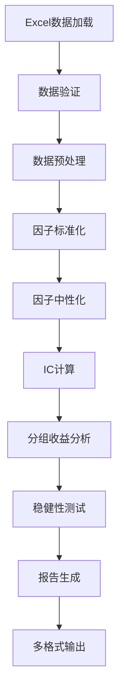

# 因子分析项目结构与功能全面分析报告

## 项目概述

本项目是一个专业的金融量化因子分析系统，采用Python开发，专门用于股票市场因子有效性评估和投资策略构建。项目经历了完整的模块化重构，从单一脚本拆分为多模块架构，大幅提升了代码的可维护性和扩展性。

## 核心技术架构

### 1. 分层架构设计

```
┌─────────────────────────────────────────────────────────────┐
│                    应用层 (yinzifenxi_main.py)                │
├─────────────────────────────────────────────────────────────┤
│  分析引擎层  │  报告生成层  │  数据处理层  │  工具支持层    │
├─────────────┼─────────────┼─────────────┼───────────────┤
│ 非参数分析   │ HTML/CSV/   │ Excel解析    │ 统计工具      │
│ 带参数分析   │ Excel报告   │ 数据验证     │ 日志管理      │
│ 双因子分析   │ 报告模板    │ 预处理      │ 配置管理      │
│ 因子中性化   │ 可视化      │ 标准化      │ 辅助函数      │
└─────────────┴─────────────┴─────────────┴───────────────┘
```

### 2. 核心模块职责

#### 数据层 (Data Layer)
- **excel_parser.py**: 多引擎Excel解析，支持pyarrow/openpyxl/pandas多种后端
- **fa_data_validator.py**: 数据完整性验证，包括列映射、类型检查、覆盖率分析
- **数据标准化**: 百分比、金额、日期等格式自动识别和转换

#### 分析引擎层 (Analysis Engine)
- **fa_nonparam_analysis.py**: 单因子非参数分析，计算IC、IR、分组收益等核心指标
- **fa_param_analysis.py**: 单因子带参数分析，支持参数区间优化和敏感性测试
- **fa_dual_nonparam_analysis.py**: 双因子非参数分析，因子对组合效果评估
- **fa_dual_param_analysis.py**: 双因子带参数分析，多维参数空间探索
- **fa_neutralizer.py**: 因子中性化处理，支持市值和行业维度中性化

#### 工具支持层 (Utility Layer)
- **fa_stat_utils.py**: 统计工具集，包含稳健相关性、滚动窗口分析、敏感性测试等
- **fa_nonparam_helpers.py**: 非参数分析辅助函数，因子分类和评分算法
- **fa_param_helpers.py**: 带参数分析辅助函数，参数优化和边界检查
- **fa_logging.py**: 统一日志管理，支持调试模式和多级别日志输出

#### 报告生成层 (Reporting Layer)
- **fa_nonparam_report.py**: 非参数分析HTML/CSV报告生成
- **fa_param_report.py**: 带参数分析综合报告，包含因子排名和投资建议
- **fa_dual_nonparam_report.py**: 双因子非参数分析热力图和统计报告
- **fa_dual_param_report.py**: 双因子带参数分析Excel详细报告
- **fa_report_utils.py**: 通用报告工具，HTML模板和表格渲染

## 关键功能特性

### 1. 多维度因子分析

#### 单因子分析
- **IC计算**: 支持Pearson、Spearman、Kendall等多种相关系数
- **分组收益**: N分组回测，年化收益和夏普比率计算
- **稳健性测试**: 滚动窗口分析、样本敏感性、时序稳定性评估
- **因子中性化**: 市值和行业维度中性化处理

#### 双因子分析
- **因子对组合**: 自动选择最优因子对组合
- **参数区间分析**: 多维参数空间的系统性探索
- **交互效应**: 因子间协同和拮抗效应量化

### 2. 高级统计功能

- **稳健统计**: Mann-Whitney U检验、自定义Spearman相关系数
- **置信区间**: Bootstrap方法计算统计量置信区间
- **异常值检测**: IQR和Z-score双重异常值识别
- **多重检验**: Benjamini-Hochberg FDR控制
- **敏感性分析**: 样本扰动和参数敏感性评估

### 3. 智能化报告系统

#### 多格式输出
- **HTML报告**: 交互式图表和详细分析结果
- **CSV数据**: 结构化数据，便于进一步分析
- **Excel报告**: 多工作表综合分析报告
- **日志记录**: 完整的分析过程追踪

#### 动态内容生成
- **因子排名**: 基于多指标综合评分的因子排序
- **投资建议**: 因子权重配置和投资组合建议
- **风险披露**: 统计显著性和稳定性风险提示

## 数据流和处理流程

### 1. 完整分析流水线



### 2. 数据源管理

- **多年度数据**: 支持多年份数据并行处理
- **智能列映射**: 自动识别和标准化列名
- **数据类型**: 百分比、金额、日期等自动转换
- **缓存机制**: akshare数据缓存，提高重复运行效率

## 配置管理

### 1. 集中化配置 (fa_config.py)
- **路径管理**: 统一的数据输入和报告输出路径
- **分析开关**: 灵活的控制各个分析模块的启用状态
- **参数调优**: 可配置的分析参数和阈值设置
- **环境变量**: 支持通过环境变量动态调整配置

### 2. 因子管理
- **因子元数据**: 语义类型、显示格式、缩放因子等
- **中性化规则**: 每个因子的中性化策略配置
- **分组规则**: 基于模式的因子自动分组

## 技术栈和依赖

### 核心依赖
- **pandas**: 数据处理和分析
- **numpy**: 数值计算
- **scipy**: 科学计算和统计分析
- **matplotlib/seaborn**: 数据可视化
- **openpyxl/pyarrow**: Excel文件处理

### 开发工具
- **Python 3.9+**: 现代Python特性支持
- **模块化设计**: 包管理和导入优化
- **类型提示**: 完整的类型注解支持
- **异常处理**: 健壮的错误处理机制

## 性能优化特性

### 1. 计算优化
- **向量化操作**: 充分利用NumPy/Pandas向量化计算
- **内存管理**: 大数据集分块处理和内存优化
- **缓存机制**: 中间结果缓存，避免重复计算

### 2. 并行处理
- **滚动分析**: 多窗口并行计算
- **敏感性测试**: 多样本并行扰动分析
- **双因子组合**: 并行因子对分析

## 质量保证

### 1. 代码质量
- **模块化设计**: 职责分离，低耦合高内聚
- **配置集中**: 避免硬编码，便于维护
- **类型安全**: 完整的类型提示和检查
- **异常处理**: 完善的错误捕获和处理

### 2. 数据质量
- **数据验证**: 多层次数据完整性检查
- **异常值处理**: 智能异常值识别和处理
- **标准化**: 一致的数据格式和类型转换
- **覆盖率分析**: 数据覆盖率和代表性评估

## 应用场景

### 1. 量化投资研究
- **因子有效性评估**: 科学评估因子的预测能力
- **投资组合构建**: 基于因子分析的投资策略
- **风险管理**: 因子暴露和风险控制

### 2. 学术研究
- **实证分析**: 金融市场实证研究支持
- **统计分析**: 多种统计方法的综合应用
- **结果可视化**: 专业的图表和报告输出

## 项目特色

### 1. 专业化设计
- **金融领域专精**: 针对A股市场特点设计
- **行业标准**: 遵循量化投资行业最佳实践
- **实用性**: 面向实际投资决策需求

### 2. 高度可配置
- **参数化分析**: 支持灵活的参数配置和优化
- **模块化架构**: 便于功能扩展和定制
- **多环境支持**: Windows/Linux环境兼容

### 3. 完整生态
- **端到端流程**: 从数据到报告的完整分析链路
- **多维输出**: 满足不同用户的报告需求
- **工具集成**: 配套的验证和比较工具

## 总结

本项目是一个功能完整、架构清晰的金融量化因子分析系统。通过模块化设计，实现了高度的可维护性和扩展性。项目不仅提供了核心的因子分析功能，还包含了完整的质量保证、性能优化和多格式报告生成能力，是量化投资研究和实践的专业工具。

项目的设计充分体现了软件工程的最佳实践，在保证功能完整性的同时，注重代码质量、性能优化和用户体验。无论是量化研究员、投资分析师还是学术研究者，都能从这个项目中获得强大的分析支持。
